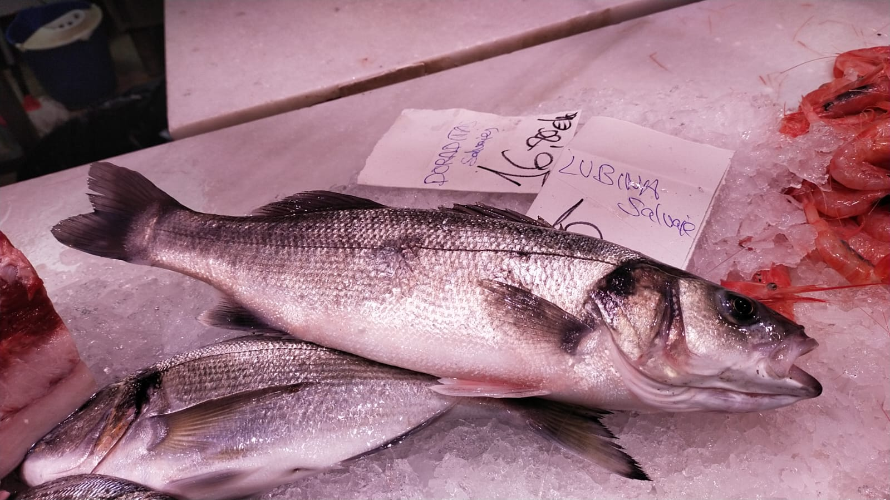
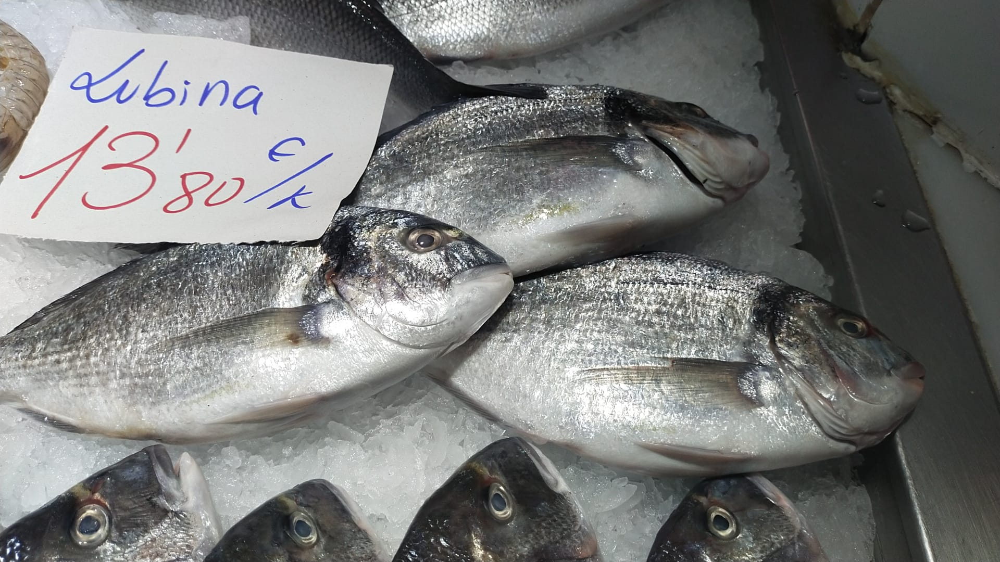

# 🐟 GLORiA Dataset – Fish && Origins 

## 👀 Overview

The **GLORiA Dataset** is an image collection designed for the study and classification of fish according to their origin. It includes images of three highly relevant species in aquaculture and fisheries:  

- **Argyrosomus regius** (*Meagre*)  
- **Dicentrarchus labrax** (*European seabass*)  
- **Sparus aurata** (*Gilthead seabream*)  

Each specimen is categorized into three groups based on its provenance:  

- **C** → Captive (aquaculture)  
- **E** → Escaped (individuals that escaped from farms)  
- **W** → Wild  

The dataset is organized into species and class specific folders, with an additional test set containing images from fish markets and also includes processed and augmented versions. It can be used in computer vision tasks such as automatic classification, deep learning experiments and comparative studies between wild and farmed fish.  
 
## 🎯 Key Features
- Provide an open resource for research on fish origin classification.  
- Enable the study of morphological differences between wild, farmed and escaped fish.  
- Contribute to projects on AI for aquaculture and sustainability.  

## 🗂️ Repository Structure
```
.
├── README.md            # This file
├── LICENSE              # MIT License
├── Zenodo                # Zenodo Link
     ├── A_regius/
     │   ├── C/   # Captive
     │   ├── E/   # Escaped
     │   └── W/   # Wild
     ├── D_labrax/
     │   ├── C/   # Captive
     │   ├── E/   # Escaped
     │   └── W/   # Wild
     ├── S_aurata/
     │   ├── C/   # Captive
     │   ├── E/   # Escaped
     │   └── W/   # Wild
     └── Market/              # Images from fish markets
         └── Market.csv     # Labels
```
## 🔎 Preview

The following table summarizes the number of images per species and origin category in the GLORiA Dataset:  

| Origin Category | A. regius (*meagre*) | D. labrax (*European seabass*) | S. aurata (*gilthead seabream*) | **Total** |
|-----------------|-----------------------|--------------------------------|---------------------------------|-----------|
| **Wild**        | 0                     | 988                            | 2,629                           | 3,617     |
| **Escaped**     | 620                   | 867                            | 355                             | 1,842     |
| **Cultivated**  | 767                   | 1,438                          | 1,857                           | 4,062     |
| **Total**       | **1,387**             | **3,293**                      | **4,841**                       | **9,521** |

<details>
<summary><strong>📸 View image samples</strong></summary>

<p align="center">
  
  
</p>
<p align="center">
  
  
</p>
<p align="center">
  
  
</p>

</details>

## 🔗 Citation

If you use this dataset in your research, please cite:

## 📝 License

This project is licensed under the MIT License - see the [LICENSE](LICENSE.txt) file for details.

## 🤝 Acknowledgments

The study was funded by the project “GLObal change Resilience in Aquaculture-TOOls for Long-term Sustainability (GLORiA-TOOLS),” supported by the Biodiversity Foundation of the Spanish Ministry for the Ecological Transition and Demographic Challenge through the Pleamar Program and co-financed by the European Maritime, Fisheries and Aquaculture Fund (EMFAF).

Project context: [GLORiA](https://github.com/Tech4DLab/GLORIA).

## 📬 Contact

| Name | Role | GitHub | Contact | Deparment | 
|------|------|--------|---------|---------|
| [Mario Jerez Tallón](https://github.com/Mariojt72) | Author | @Mariojt72 | mario.jerez@ua.es | Computer Technology
| [Ismael Beviá Ballesteros](https://github.com/ibevias) | Co-authors | @ibevias | ismael.bevias@ua.es | Computer Technology
| Dr. Kilian Toledo-Guedes | PI | – | ktoledo@ua.es | Marine Sciences
| Jaime Fernandez del Campo | Data curation | – | jaime.fdezdelcampo@ua.es | Marine Sciences
| David Pitarch Font | Data curation | – | david.pitarch@ua.es | Marine Sciences
| [Dr. Nahuel Emiliano Garcia d'Urso](https://github.com/nawue) | Co-authors | @nawue | nahuel.garcia@ua.es | Computer Technology
| Dr. Andrés Fuster Guilló | PI | – | fuster@ua.es | Computer Technology
| Dr. Jorge Azorín López | PI | – | jazorin@ua.es | Computer Technology
